# Crop-Image-Classification (AIcup 2022 in Taiwan)
[](https://colab.research.google.com/drive/15kOuZZaUoDG33LCQCy-qHHHROab0ViiZ?usp=sharing) 

我國農地範圍廣泛，但分佈破碎，造成收集資源的人力和時間成本極高，且農業領域相對缺乏AI技術，因此本實作將會把大量已收集並標住過的農作物進行分類和預測。

# Dataset
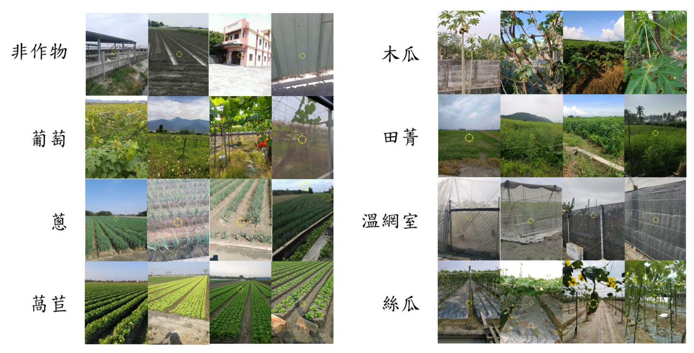

- `資料內容`: 現地作物調查影像，包括拍攝不良影像，例如：房屋、車輛、農機具、模糊畫面等
- `提供單位`: 行政院農業委員會
- `影像分類`: 含非作物共33類
- `資料數量`: 總計10萬張以上
- `影像解析度`: 最小1280x720 ; 最大 4000x3000
- `檔案大小`: 總計約 170 GB

# Problem
## 1. 準心可用性
準心為協助專家判斷作物之依據，但準心也可能產生偏移。其中非中心的準心標記有 22 %。其中只有 0.5 % 資料準心偏移中心超過 100(差不多準心大小)。且幾乎全部偏移都是在 Y 軸。
下圖可以看到準心標記錯誤的問題，因此種照片佔極少數，所以先忽略。我們初步作法是以準心為基準往外取夠大的範圍，只要照片中有包含到準心和周遭一定範圍的作物就好。
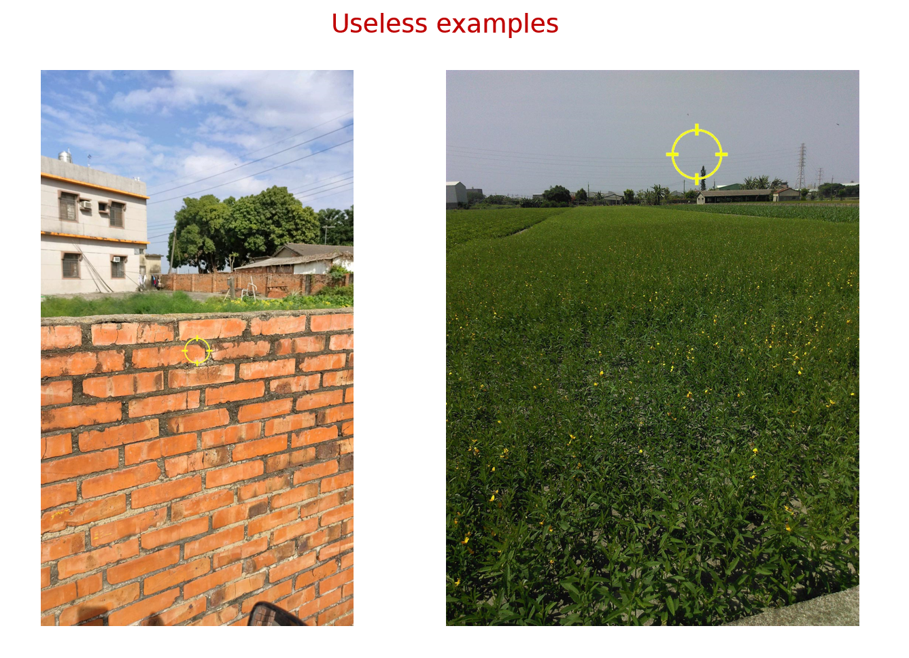

## 2. 解析度 & 檔案大小
照片本身的解析度大小會影響整個模型訓練的難度，解析度越高需要越多的記憶體、訓練時間、模型參數量，此外，在資料移動上也會很費力。
然而在高解析度的照片中有許多像素都是重複值，當大到一定程度後會對模型預測幫助不大，太高甚至會干擾結果。此外，模型也需要配合去增加隱藏層和模型複雜度才能有效去學習高解析度的圖片。
因此，在初始解析度大小上，我們統一將原始最高的 `2400 萬像素`壓縮 `200 萬畫素`左右。原始資料也從 `127 G` 減少到 `32 G`，方便後續資料的處理與搬移。
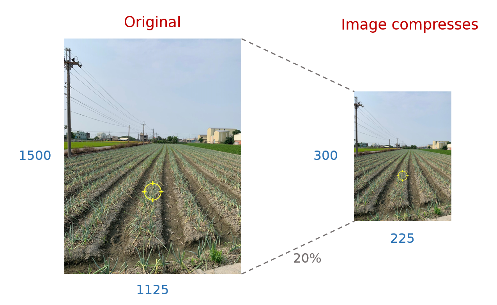

## 3. 統一輸入照片長寬
照片需要統一固定的大小才能輸入到模型中進行訓練，主要的做法有`剪裁(crop)`和`縮放(resize)`。不同的處理&取樣方式會影響模型學習的結果，如下圖就是以統一大小的正方形對照片做 `Crop`，以此作為輸入特徵。
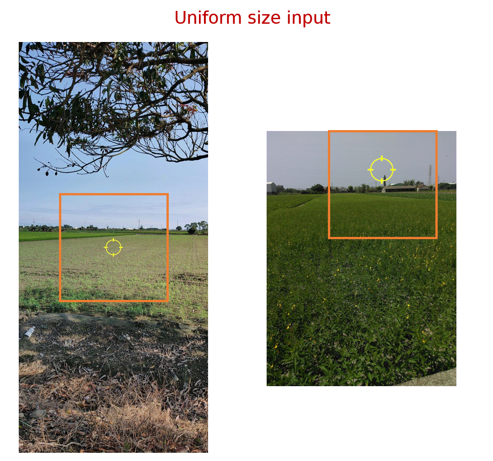

## 4. 照片轉向問題
在資料中有些圖片可能會有翻轉的現象，當某些方向的照片太少會導致模型無法有效辨識有轉向的照片。處理這問題有兩種方向，一是偵測非正向的照片並將其轉回正常方向，二是讓模型學習不同方向的照片，也就是資料增強的技術。在資料增強上一般的作法是將一張照片複製成四張分別轉向不同方向。使用 `torchvision.transforms.RandomRotation` 方法讓模型在訓練過程中， dataloader 會隨機對圖片進行翻轉，讓模型可以學習到不同方向的資訊。
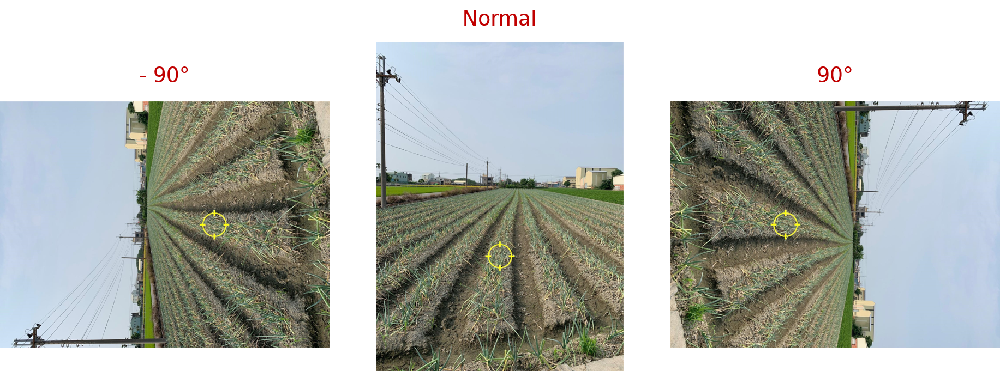

## 5. 照片亮度 & 色彩差異
在蒐集照片時可能會因為天氣、光源或是設備上的成像差異導致模型難以對圖片進行學習。所以圖片做標準化是很重要的一個步驟因為圖片標準化可以降低在實際成像上的差異與干擾，讓模型可以更容易去比較照片中的資訊。在圖片標準化的部分，我們使用 `torchvision.transforms.Normalize` 函式對圖片進行 `z-score normalization`。
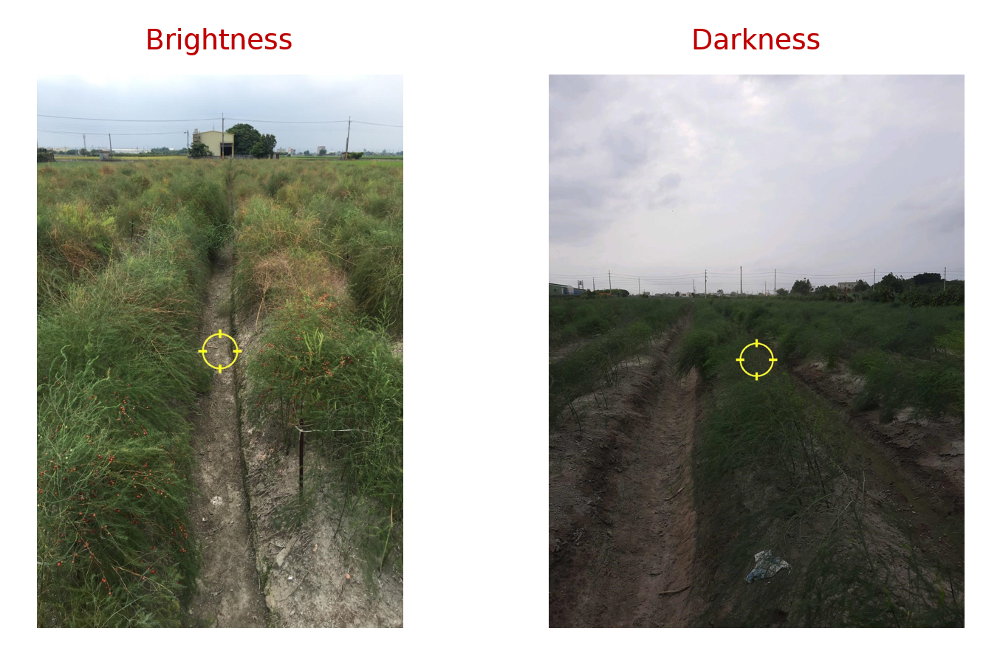

# Model used - CoAtNet
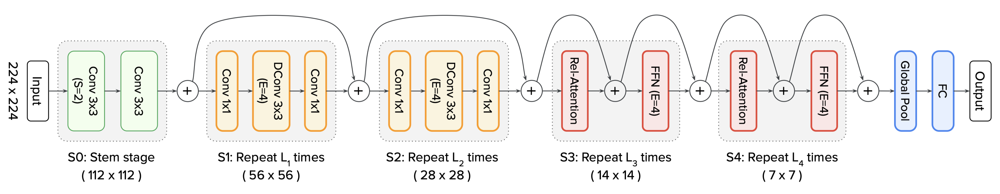
此模型架構由CNN結合Transformer改進而來，傳統CNN架構藉由提取方形範圍中的特徵和前饋來進行模型建構，充分利用二維圖形單一範圍內像素相互關係，但對於圖形全域關聯敏感對較低；Transformer模型與CNN特性恰好相反，對於全域關聯敏感性高，小範圍中關聯敏感性低，此模型結合兩者的優點，對圖片先利用CNN提取出局部特徵，再前饋進入Transformer模型。

_論文連結: https://arxiv.org/abs/2106.04803_

# Experiment Result
## environment
在模型參數上因時間與效能限制使用原作者預設的模型。在訓練環境下，因為沒顯卡運算資源，所以 kaggle 提供的 GPU(Tesla P100-PCIE-16GB)。然而在 kaggle 上有一個 session 有12 小時的限制，所以我們將模型輸入限制在照片大小限制在 224x244，這樣就可以在時間內跑完 25 epoch。
在資料集上將資料切分成 train(0.7)、val(0.1)、test(0.2)訓練時會使用 train 資料進入模型進行訓練，每個 epoch 會使用 val 資料進行驗證，並保留 val 結果最好的模型
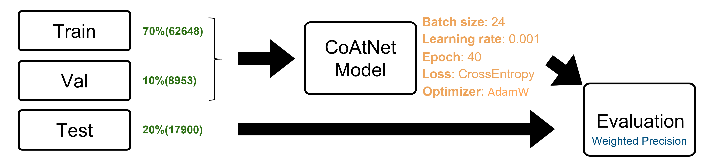


## EX1. 樣本數量
### result
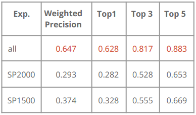

## EX2. Crop & Resize 方式
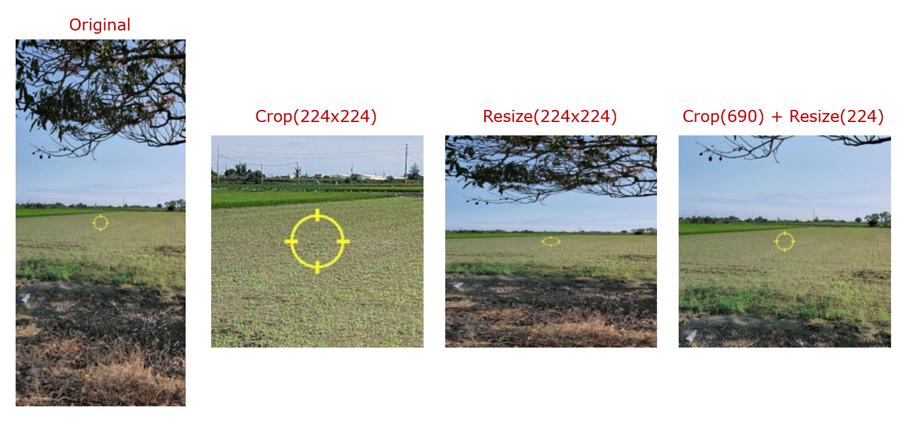
### result
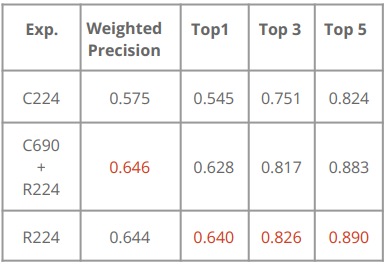


## EX3. Mask 天空
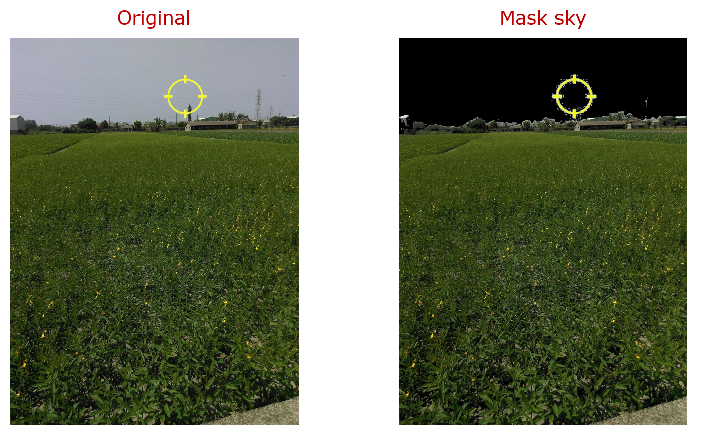
### result
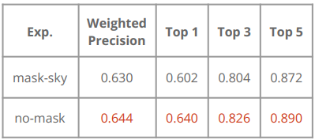

## EX4. 經緯度資訊的導入
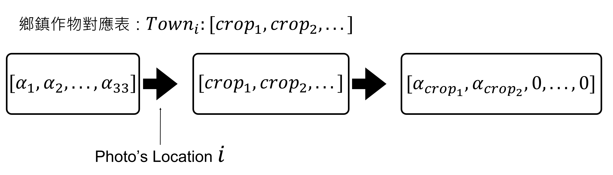
### result
提升 2% 左右

# Reproduce
## 📁 Folder schema 
```
Crop-Image-Classification
    |-- data 

    |-- doc: 相關文件

    |-- model: 模型

    |-- notebook: 分析視覺化

    |-- output: 輸出實驗的 log 和 model

    |-- scripts: shell or batch 腳本，包含批次跑實驗、訓練範例
        |- generate_dataset: 各實驗使用 scripts/image_process.py 產生訓練資料
        |- train: 使用 train.py 訓練資料的實驗參數
        |-> check_image_size.py: 檢查圖片大小
        |-> image_process.py: 圖片處理
        |-> download_file.sh: 下載 google drive 資料
        |-> sort_exp_result.py: 整理 train.py 輸出的實驗結果
    
    |-- utils

    |-> requirements.txt: python 依賴套件
    |-> train.py: 主要訓練程式碼
    |-> LICENSE
    |-> README.md
```
## 🖥️ Environment settings 
### `pytorch`
```shell
pip3 install torch torchvision torchaudio --extra-index-url https://download.pytorch.org/whl/cu116
```
- 如使用不同環境請到 [pytorch 官網](https://pytorch.org/) 選擇對應版的指令。

### `other packages`
```shell
pip3 install -r requirements.txt
```

## 🙋 Quick start 
這部分使用小樣本的資料，結果僅供參考
### `Step1: Clone 程式碼`
```shell
git clone https://github.com/aaron1aaron2/Crop-Image-Classification.git
cd Crop-Image-Classification
```

### `Step2: 資料準備`
#### 下載測試資料
```shell
source scripts/download_file.sh "1ew3d6llpvj7ev1CssUbxiZ3FcANFRaOW&" "sample100_L160(test)" "data/sample100_L160(test)"
```

也可以直接到 [Google drive](https://drive.google.com/uc?id=1ew3d6llpvj7ev1CssUbxiZ3FcANFRaOW&confirm=t) 下載，並解壓縮到 _data/sample100_L160(test)_ 底下。

#### `or`
#### 產生訓練資料
```shell
python scripts/image_process.py
```


### `Step3: 開始訓練`
```shell
python train.py
```

# Citation
```bibtex
@article{dai2021coatnet,
  title={CoAtNet: Marrying Convolution and Attention for All Data Sizes},
  author={Dai, Zihang and Liu, Hanxiao and Le, Quoc V and Tan, Mingxing},
  journal={arXiv preprint arXiv:2106.04803},
  year={2021}
}
```

# Credits

Code adapted from [CoAtNet](https://github.com/chinhsuanwu/coatnet-pytorch)
